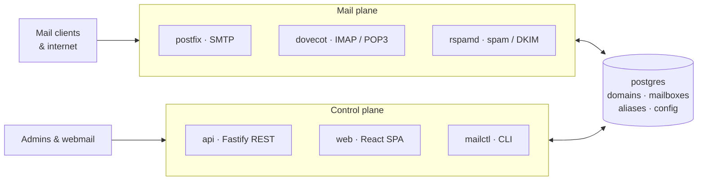

# mail-dock

**A commercially licensed, multi-domain mail server.** Postfix, Dovecot and Rspamd orchestrated as containers behind a Node 24 / Fastify control plane — shipped as a Docker Compose bundle a customer installs with one command.

> **Start in [`context`](https://github.com/mail-dock/context)** — the superproject. It aggregates every repo as a submodule and holds the architecture and conventions the others defer to.

---

## Repositories

| Repo | Purpose |
| --- | --- |
| **[context](https://github.com/mail-dock/context)** | Superproject. No application logic — submodules, architecture, conventions, run-books, skills. **Start here.** |
| **[mailserver](https://github.com/mail-dock/mailserver)** | The product. pnpm/Turborepo monorepo — `apps/{api,web,worker,cli}`, `packages/*`, `docker/`, `compose/`. |
| **[license-server](https://github.com/mail-dock/license-server)** | Licensing SaaS — key issuance, Stripe Billing, registry auth. Deployed by us, never shipped. |

```bash
git clone --recurse-submodules git@github.com:mail-dock/context.git
```

---

## How it fits together



Domains, mailboxes and aliases are **rows in Postgres that the daemons read live** — creating a mailbox is an insert, not a config regeneration. Only server-level settings are rendered to daemon config, and every render is validated inside the daemon container before it goes live, with versioned rollback.

Details: [`architecture.md`](https://github.com/mail-dock/context/blob/main/docs/architecture.md) · [ADRs](https://github.com/mail-dock/mailserver/tree/main/docs/adrs)

---

## Features

- **[Domains](https://github.com/mail-dock/mailserver/blob/main/docs/feature-docs/domains.md)** — many per server, with generated DNS records to publish.
- **[Mailboxes](https://github.com/mail-dock/mailserver/blob/main/docs/feature-docs/mailboxes.md)** — IMAP/POP3 accounts with quotas, suspend, password reset; authenticated submission.
- **[Aliases, forwarders, catch-all](https://github.com/mail-dock/mailserver/blob/main/docs/feature-docs/aliases-forwarders-catchall.md)** — the cPanel routing feature set, all pure data.
- **[REST API](https://github.com/mail-dock/mailserver/blob/main/docs/feature-docs/rest-api.md)** — `/api/v1` with OpenAPI generated from the schemas; the integrator contract and what every client uses.
- **[Headless install](https://github.com/mail-dock/mailserver/blob/main/docs/feature-docs/headless-install.md)** — one answers file, no browser, for MSPs and CI.
- **TLS** — Caddy with ACME, or bring your own certificate.
- **Spam & signing** — Rspamd for filtering, DKIM, ARC and DMARC.
- **Licensing** — signed keys with offline grace and graceful degrade; **mail never stops.**
- **AI** — customer's own provider key or a local model. We ship no inference.

Every feature has a doc in [`feature-docs/`](https://github.com/mail-dock/mailserver/tree/main/docs/feature-docs).

---

## Install

Debian 12 / Ubuntu 22.04+, public IPv4, a hostname with matching A and PTR records.

```bash
curl -fsSL https://get.<bootstrap-host>/install.sh | sh -s -- --hostname mail.example.com
```

Installs Docker and `mailctl`, runs preflight, starts the stack, then prints the Setup Wizard URL. Add `--answers setup.yaml` to complete setup without a browser. Publish the DNS records it prints and you have working mail.

Day two: `mailctl doctor` · `backup` · `restore` · `upgrade`. Everything else is the admin UI or the API — there is nothing to hand-edit on the host.

Guides: [install](https://github.com/mail-dock/mailserver/blob/main/docs/run-books/install.md) · [upgrade](https://github.com/mail-dock/mailserver/blob/main/docs/run-books/upgrade.md) · [backup & restore](https://github.com/mail-dock/mailserver/blob/main/docs/run-books/backup-restore.md) · [doctor](https://github.com/mail-dock/mailserver/blob/main/docs/run-books/doctor.md) · [bring your own TLS](https://github.com/mail-dock/mailserver/blob/main/docs/run-books/bring-your-own-tls.md)

---

## Develop

Node 24, pnpm 11, Docker with Compose v2.

```bash
git clone --recurse-submodules git@github.com:mail-dock/context.git
cd context/mailserver
pnpm install
cp compose/.env.example compose/.env
pnpm stack:up                 # 8 services, migrations on boot
pnpm test                     # needs TEST_DATABASE_URL for the integration half
pnpm smoke                    # end-to-end mail flow against the stack
```

API docs at `http://localhost:3000/api/v1/docs`. Full walkthrough, ports and gotchas: [dev-environment.md](https://github.com/mail-dock/mailserver/blob/main/docs/run-books/dev-environment.md).

**One rule to internalise:** never hand-edit daemon config. Edit the templates in `packages/engine-postfix-dovecot/`, then apply through the API.

---

## How we work

Gitflow · Conventional Commits · all repos share one version and are tagged together. **Documentation ships in the same change as the code it describes** — a commit that changes behaviour without touching its docs is incomplete. Tests run before every commit. Secrets never live in a repo.

Full set: [`conventions.md`](https://github.com/mail-dock/context/blob/main/docs/conventions.md). Agent sessions start with [`context/CLAUDE.md`](https://github.com/mail-dock/context/blob/main/CLAUDE.md) and end with `/close-out`.
